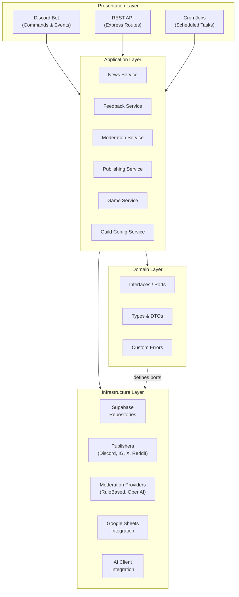
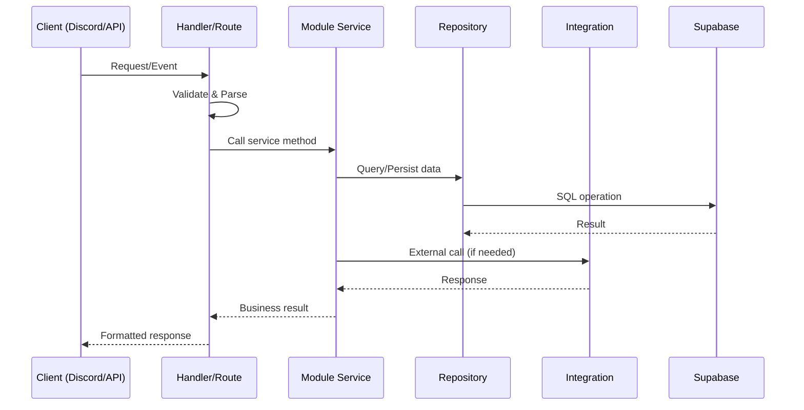
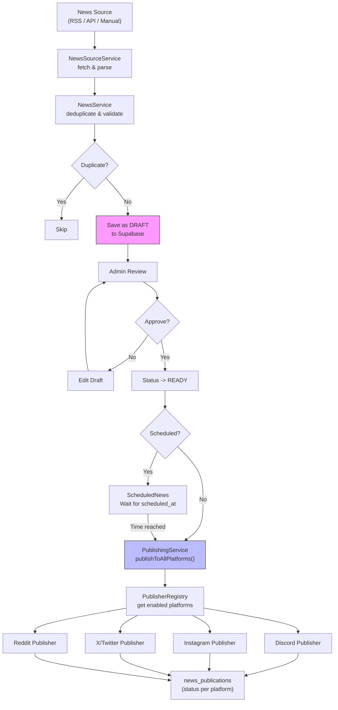
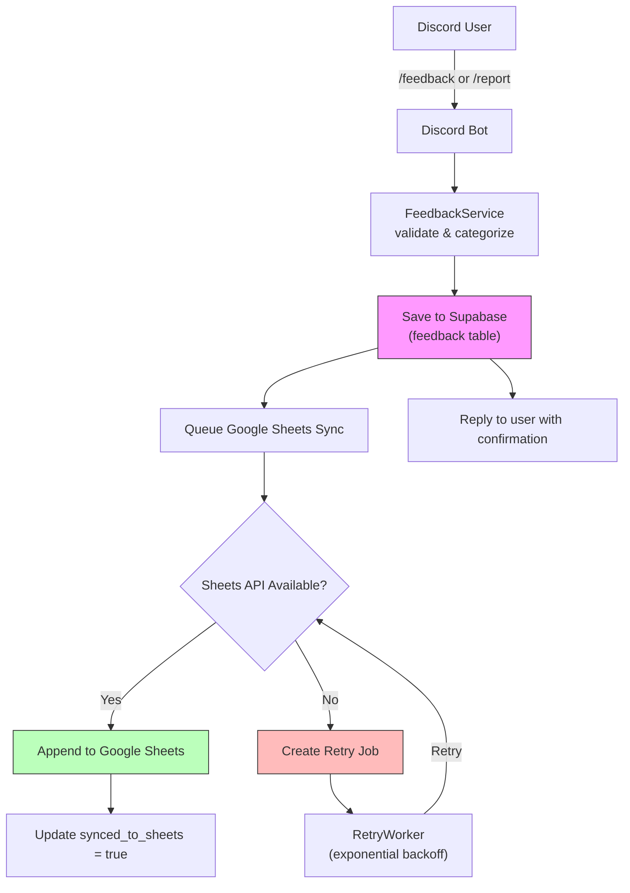
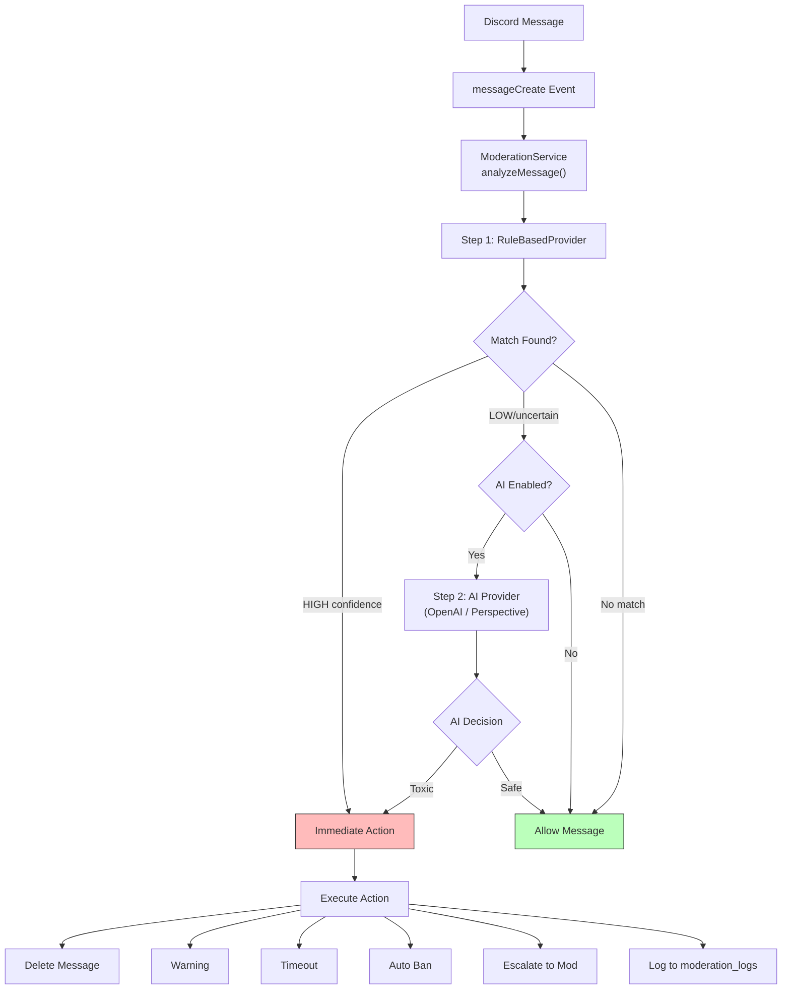
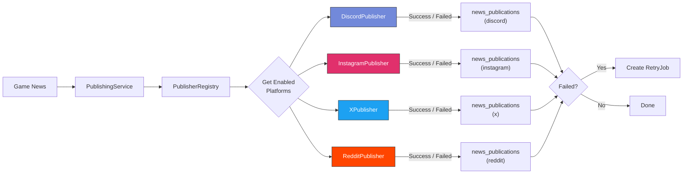
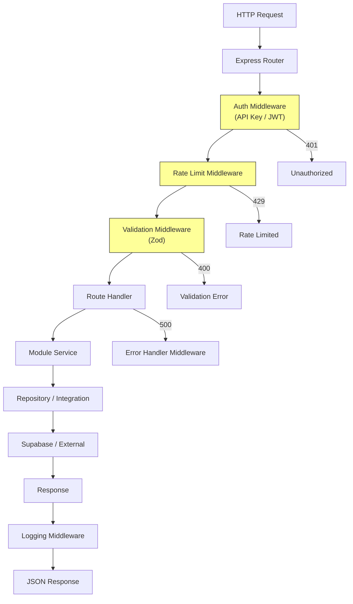

# Architecture & System Flow

This document details the architectural decisions, design patterns, layer hierarchy, and end-to-end system flows of the Game Community Bot platform.

---

## Architecture Decision

This project uses **Modular Clean Architecture** with **Hexagonal (Ports & Adapters)** influences:

| Approach | Pros | Cons | Verdict |
|---|---|---|---|
| Monolithic MVC | Simple, fast start | Poor separation, platform-coupled | Rejected |
| Full Microservices | Independent scaling | Over-engineered for initial stage | Rejected |
| **Modular Monolith + Ports/Adapters** | **Clean boundaries, testable, scalable later** | **Slightly more initial setup** | Selected |
| Full DDD | Rich domain model | Too heavyweight for this scope | Rejected |

### Why this works:
- Multi-platform publishing demands an adapter pattern (swap publishers without touching core business logic).
- AI moderation needs provider abstraction (swap OpenAI for Perspective without code changes).
- Single deployable initially, but each module boundary serves as an extraction point for microservices in the future.
- Business logic is 100% testable without mocking Discord.js, Supabase, or external SDKs.

---

## Layer Diagram



### Dependency Flow

```
Presentation -> Application -> Domain <- Infrastructure
                                ^
                        (implements interfaces)
```

> **Key Rule:** Infrastructure implements interfaces defined in the Domain layer (Dependency Inversion). The Application layer orchestrates business logic. The Presentation layer handles I/O adaptation.

---

## Request Lifecycle



---

## System Flows

### 1. Game News Flow



**Key Points:**
- News always starts as **DRAFT** to prevent accidental publishing.
- Deduplication is handled via `external_id` (article URL or external ID).
- Each platform publish is **independent**; one failure never blocks others.
- Failed publishes automatically create retry jobs in `retry_jobs`.
- Per-platform status is tracked in `news_publications`.

---

### 2. Customer Service / Feedback Flow



**Key Points:**
- Data is **always saved to Supabase first**; Google Sheets failure never results in lost feedback.
- Retries use exponential backoff (1s -> 2s -> 4s up to 30s max).
- Metadata captured: user ID, username, game, category, message, timestamp, status.
- Privacy: Personal data is not exposed; Supabase RLS protects access.

---

### 3. Moderation Flow



**Key Points:**
- **Hybrid approach**: Rule-based first (fast, free, under 1ms), AI second (only if uncertain or enabled).
- AI is not executed for every message, which drastically reduces API latency and cost.
- Provider abstraction allows changing AI providers without altering core moderation logic.

---

### 4. Multi-Platform Publishing Flow



---

### 5. REST API Flow


