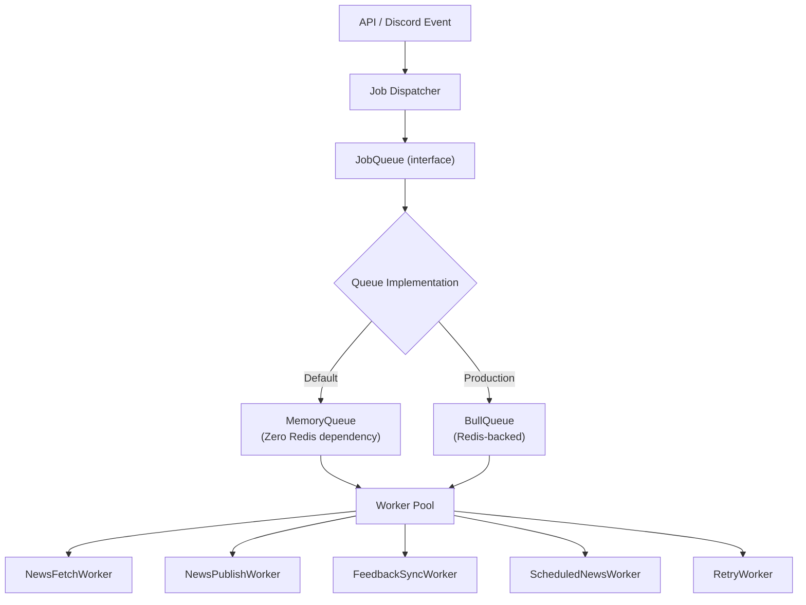

# Background Jobs & Workers

This document covers the job queue abstraction, background workers, scheduled cron tasks, and architectural comparisons between in-memory queues and Redis-backed BullMQ.

---

## Queue Architecture

The job system decouples message ingestion and business events from heavy external I/O tasks:



---

## Queue Interface

```typescript
// src/shared/interfaces/queue.interface.ts

interface JobQueue {
  enqueue<T>(jobType: string, payload: T, options?: JobOptions): Promise<string>;
  process(jobType: string, handler: JobHandler): void;
  getStatus(jobId: string): Promise<JobStatus>;
}

interface JobOptions {
  delay?: number;          // Delay in milliseconds
  priority?: number;       // Higher priority executed first
  retries?: number;        // Maximum retry count
  backoff?: number;        // Backoff factor
}
```

---

## Scheduled Cron Tasks (node-cron)

| Job Identifier | Frequency | Purpose |
|---|---|---|
| `news-fetch` | Every 15 minutes | Polls registered game RSS feeds and developer APIs for fresh updates |
| `scheduled-news` | Every 1 minute | Queries `scheduled_news` for timed articles ready to publish |
| `retry` | Every 5 minutes | Re-executes failed tasks recorded in `retry_jobs` |
| `cleanup` | Daily at 03:00 UTC | Archives old moderation logs and cleans temporary scratch data |

---

## Trade-Offs: MemoryQueue vs BullMQ

| Capability | MemoryQueue (Default) | BullMQ + Redis |
|---|---|---|
| External Dependencies | None (zero setup) | Requires Redis instance |
| Durability | In-memory (lost on restart) | Persistent across process restarts |
| Scaling | Single process only | Multi-worker distributed concurrency |
| Dashboard | Application logs | Bull Board UI |
| Best For | Development, staging, small guilds | High-volume production deployments |

To switch from `MemoryQueue` to `BullMQ`, set `QUEUE_PROVIDER=bull` and supply `REDIS_URL` in your environment configuration.
