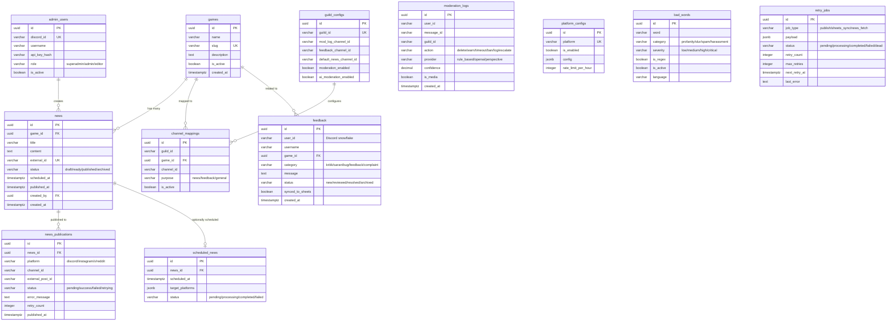

# Database Architecture & Schema

This document provides complete documentation of the PostgreSQL database hosted on Supabase, including entity relationships, table specifications, and security policies.

---

## Entity Relationship Diagram (ERD)



---

## Table Details

### 1. Core Tables

| Table | Purpose | Key Columns | Key Indexes |
|---|---|---|---|
| `games` | Game catalog registry | `id`, `name`, `slug`, `is_active` | `slug` (unique) |
| `news` | News articles with draft/publish status | `id`, `game_id`, `title`, `content`, `external_id`, `status` | `game_id`, `external_id` (unique, dedup), `status`, `scheduled_at` |
| `news_publications` | Per-platform publication status | `id`, `news_id`, `platform`, `status`, `retry_count` | `news_id`, `platform`, `status` |
| `feedback` | User feedback across 5 categories | `id`, `user_id`, `category`, `message`, `status`, `synced_to_sheets` | `user_id`, `game_id`, `category`, `status`, `synced_to_sheets` |
| `moderation_logs` | Audit trail for moderation actions | `id`, `user_id`, `guild_id`, `action`, `confidence` | `user_id`, `guild_id`, `created_at` |

### 2. Configuration Tables

| Table | Purpose | Key Columns | Key Indexes |
|---|---|---|---|
| `guild_configs` | Per-guild bot configuration | `id`, `guild_id`, `mod_log_channel_id`, `moderation_enabled` | `guild_id` (unique) |
| `channel_mappings` | Map games to Discord channels | `id`, `guild_id`, `game_id`, `channel_id`, `purpose` | `(guild_id, game_id, purpose)` unique |
| `platform_configs` | Social platform settings and rate limits | `id`, `platform`, `is_enabled`, `config`, `rate_limit_per_hour` | `platform` (unique) |
| `bad_words` | Prohibited words and regex patterns | `id`, `word`, `category`, `severity`, `is_regex`, `is_active` | `(word, language)` unique, `is_active` |
| `admin_users` | REST API credentials & RBAC | `id`, `discord_id`, `api_key_hash`, `role`, `is_active` | `discord_id` (unique), `api_key_hash` |

### 3. Background Job Tables

| Table | Purpose | Key Columns | Key Indexes |
|---|---|---|---|
| `scheduled_news` | Queued timed news publications | `id`, `news_id`, `scheduled_at`, `status` | `news_id` (unique), `scheduled_at`, `status` |
| `retry_jobs` | Queue for failed operations | `id`, `job_type`, `payload`, `status`, `next_retry_at` | `job_type`, `status`, `next_retry_at` |

---

## Row Level Security (RLS)

All tables use the Supabase `service_role` key with default-deny RLS policies:

```sql
-- Example: Enable RLS on all tables
ALTER TABLE games ENABLE ROW LEVEL SECURITY;
ALTER TABLE news ENABLE ROW LEVEL SECURITY;
ALTER TABLE news_publications ENABLE ROW LEVEL SECURITY;
ALTER TABLE feedback ENABLE ROW LEVEL SECURITY;
ALTER TABLE moderation_logs ENABLE ROW LEVEL SECURITY;
ALTER TABLE guild_configs ENABLE ROW LEVEL SECURITY;
ALTER TABLE channel_mappings ENABLE ROW LEVEL SECURITY;
ALTER TABLE platform_configs ENABLE ROW LEVEL SECURITY;
ALTER TABLE bad_words ENABLE ROW LEVEL SECURITY;
ALTER TABLE admin_users ENABLE ROW LEVEL SECURITY;
ALTER TABLE scheduled_news ENABLE ROW LEVEL SECURITY;
ALTER TABLE retry_jobs ENABLE ROW LEVEL SECURITY;

-- Default deny: No access via anon key
-- All bot and API operations authenticate using the backend service_role key
```

> **Security Note:** This is a server-side bot application. Supabase queries run on the backend using the `SUPABASE_SERVICE_ROLE_KEY`. RLS default-deny provides defense-in-depth in case the anonymous key is ever exposed.
